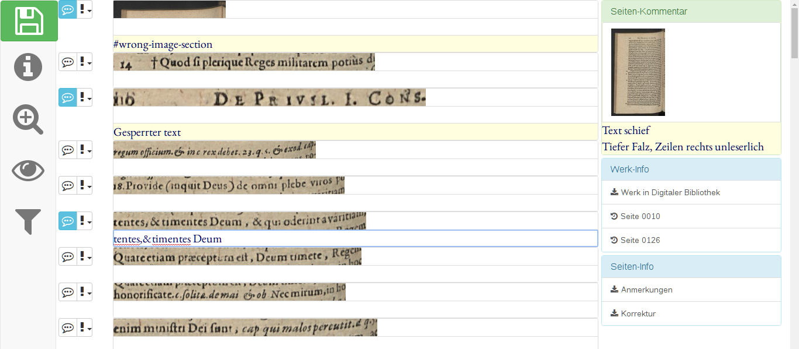

ocr-gt-tools
============

A web interface for creating ground truth for evaluating and training OCR.

## Table of Contents

* [Summary](#summary)
	* [Screenshot](#screenshot)
	* [Features](#features)
	* [Installation](#installation)
	* [About the code](#about-the-code)
* [Usage](#usage)
* [Contributing](#contributing)
	* [Pull Requests](#pull-requests)
	* [Bug reports](#bug-reports)
* [Acknowledgments](#acknowledgments)

## Summary

ocr-gt-tools allows editing
[hOCR](https://github.com/kba/hocr-spec/blob/master/hocr-spec.md) files,
such as those produced by the
[tesseract](https://github.com/tesseract-ocr/tesseract) or
[ocropy](https://github.com/tmbdev/ocropy) OCR frameworks.

### Screenshot

### Features

* Editing transcriptions of lines
* Commenting on line and page level
* Use [standardized comment tags](https://github.com/UB-Mannheim/ocr-gt-tools/wiki/Error-Tags) to mark common problems
* [Cheatsheet](./doc/screenshots/cheatsheet-2016-05-04.png)
* Zoom in / Zoom out
* Filter visible elements
* Select multiple lines and apply tags.

### Installation

See [INSTALL.md](./INSTALL.md).

### About the code

The server-side code is written in Perl.

The frontend is written in HTML and Javascript.

## Usage

- Open 'ocr-gt-tools/index.html' with a browser
- open in a second Window 'Page Previews' from Kitodo
- Search the book from which you created the hOCR file
- Drag and drop a image from the Kitodo 'Page Preview' Window to the Window with 'ocr-gt-tools/index.html'
- The perl script ocr-gt-tools.cgi will create in the background all files, which takes a few seconds
- with ajax a json objects will be returned to index.html
- index.html will load with ajax the created 'correction.html' and 'anmerkungen.txt' inline
- 'Speichern' will get active if you have written a comment or a text line

## Contributing

### Expand the wiki

We are using the wiki to collect [transcription hints for unusual
glyphs](wiki/Special-Characters) and [frequent errors](wiki/Error-Tags). 

### Pull Requests

Bug fixes, new functions, suggestions for new features and other user feedback
are appreciated.

The source code is available from https://github.com/UB-Mannheim/ocr-gt-tools.
Please prepare your code contributions also on Github.

### Bug reports

Please feel free to [open
issues](https://github.com/UB-Mannheim/ocr-gt-tools/issues) for any bug you
encounter and features you'd like to have.

## Acknowledgments

This is free software. You may use it under the terms of the
GNU AFFERO General Public License (AGPL) version 3 or newer.
See [LICENSE](LICENSE) for details.

This project bundles other free software:

* [EB Garamond Font](https://www.google.com/fonts/specimen/EB+Garamond) (SIL Open Font License)
* [Font Awesome by Dave Gandy](http://fontawesome.io/) (SIL OFL 1.1, MIT)
* [bootstrap](http://getbootstrap.com/) (MIT)
* [clipboard.js](https://github.com/zenorocha/clipboard.js) (MIT)
* [handlebars.js](https://github.com/wycats/handlebars.js) (MIT)
* [hocr-extract-images](https://github.com/tmbdev/hocr-tools) (Apache)
* [jQuery](http://jquery.com/) (MIT)
* [ocropus-gtedit](https://github.com/tmbdev/ocropy) (Apache)
* [reset-css](https://github.com/shannonmoeller/reset-css) (Public Domain)
