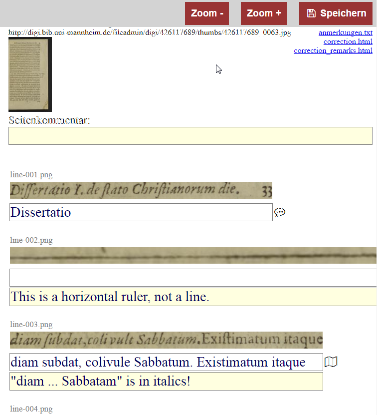

# ocr-gt-tools

A web interface for creating ground truth for improving OCR 

## Table of Contents

  * [Summary](#summary)
    * [About the code](#about-the-code)
  * [Installation](#installation)

## Summary

ocr-gt-tools allows editing
[hOCR](https://github.com/kba/hocr-spec/blob/master/hocr-spec.md) hOCR files,
such as those produced by the
[tesseract](https://github.com/tesseract-ocr/tesseract) or
[ocropy](https://github.com/tmbdev/ocropy) OCR frameworks.

### About the code

The server-side code is written in Perl.

The frontend is made up of HTML and Javascript.

### Installation

See [INSTALL.md](INSTALL.md) for details.

## Usage

- you must previously have created the hOCR file, for example with [Tesseract](https://github.com/tesseract-ocr/tesseract)
- Open 'ocr-gt-tools/index.html' with a browser
- open in a second Window 'Page Previews' from Goobi
- Search the book from which you created the hOCR file
- Drag and drop a image from the Goobi 'Page Preview' Window to the Window with 'ocr-gt-tools/index.html'
- The perl script ocr-gt-tools.cgi will create in the background all files, which takes a few seconds
- with ajax a json objects will be returned to index.html
- index.html will load with ajax the created 'correction.html' and 'anmerkungen.txt' inline
- in a tool-bar on top you get some buttons
  - Alle einklappen
  - Alle ausklappen
  - Zoom -
  - Zoom =
  - Zoom +
  - Speichern
- 'Speichern' will get active if you have written a comment or a text line
- when a new image is dropped and it is unsaved content available a warning is issued, same as if the hash is changed in the url

## Bug reports

Please send your bug reports to https://github.com/UB-Mannheim/ocr-gt-tools/issues.
Make sure that you are using the latest version of the software
before sending a report.

## Contributing

Bug fixes, new functions, suggestions for new features and
other user feedback are appreciated.

The source code is available from https://github.com/UB-Mannheim/ocr-gt-tools.
Please prepare your code contributions also on Github.

## Acknowledgments

Copyright (C) 2016 Universitätsbibliothek Mannheim

Authors: Bernd Fallert (UB Mannheim)

This is free software. You may use it under the terms of the
GNU General Public License (GPL). See [LICENSE](LICENSE) for details.

This project uses other free software:

* [Font Awesome by Dave Gandy](http://fontawesome.io/) (SIL OFL 1.1, MIT License)
* [jQuery](http://jquery.com/) (MIT License)
* [hocr-extract-images](https://github.com/tmbdev/hocr-tools) (Apache License)
* [ocropus-gtedit](https://github.com/tmbdev/ocropy) (Apache License)
